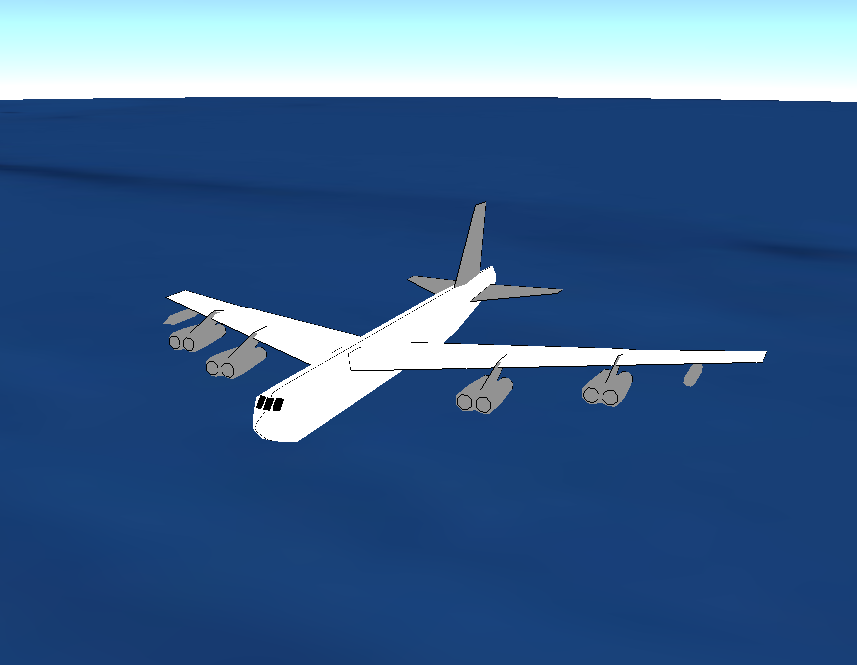

.. ****************************************************************************
.. CUI
..
.. The Advanced Framework for Simulation, Integration, and Modeling (AFSIM)
..
.. The use, dissemination or disclosure of data in this file is subject to
.. limitation or restriction. See accompanying README and LICENSE for details.
.. ****************************************************************************

.. demo:: training:platform_types

.. |classification| replace:: Unclassified
.. |date|           replace:: 2020-04-22
.. |group|          replace:: Training
.. |image|          replace:: images/platform_types.png
.. |tags|           replace:: n/a
.. |title|          replace:: Platform Types
.. |startup|        replace:: floridistan.txt
.. |summary|        replace:: This directory contains the solution for the Platform Types and Platforms section of Basic User Training. Step 3.

.. include:: demo_template.txt

| The solution for the PLATFORM_TYPE's part of Basic User Training.
