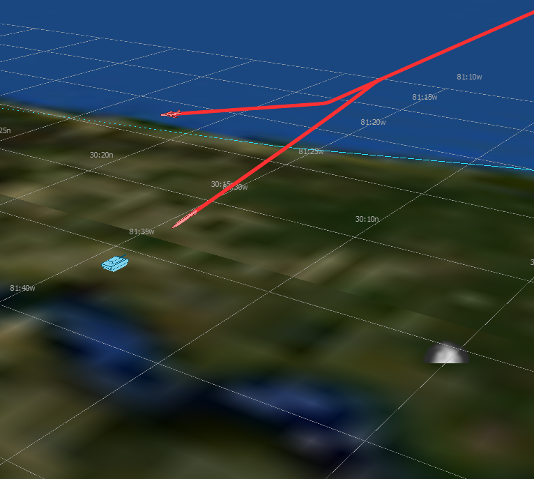

.. ****************************************************************************
.. CUI
..
.. The Advanced Framework for Simulation, Integration, and Modeling (AFSIM)
..
.. The use, dissemination or disclosure of data in this file is subject to
.. limitation or restriction. See accompanying README and LICENSE for details.
.. ****************************************************************************

.. demo:: training:weapons_execute

.. |classification| replace:: Unclassified
.. |date|           replace:: 2020-04-22
.. |group|          replace:: Training
.. |image|          replace:: images/weapons.png
.. |tags|           replace:: n/a
.. |title|          replace:: Weapons and Execute
.. |startup|        replace:: floridistan.txt
.. |summary|        replace:: This directory contains the solution for the Weapons and Execute section of Basic User Training. Step 5.

.. include:: demo_template.txt

| The solution for the Weapons and Execute part of Basic User Training.
