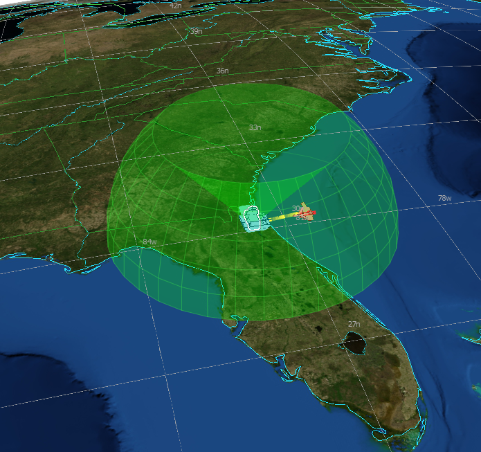

.. ****************************************************************************
.. CUI
..
.. The Advanced Framework for Simulation, Integration, and Modeling (AFSIM)
..
.. The use, dissemination or disclosure of data in this file is subject to
.. limitation or restriction. See accompanying README and LICENSE for details.
.. ****************************************************************************

.. demo:: training:sensors_and_tracks

.. |classification| replace:: Unclassified
.. |date|           replace:: 2020-04-22
.. |group|          replace:: Training
.. |image|          replace:: images/sensors.png
.. |tags|           replace:: n/a
.. |title|          replace:: Sensors and Tracks
.. |startup|        replace:: floridistan.txt
.. |summary|        replace:: This directory contains the solution for the Sensors and Tracks section of Basic User Training. Step 7.

.. include:: demo_template.txt

| The solution for the Sensors and Tracks part of Basic User Training.
