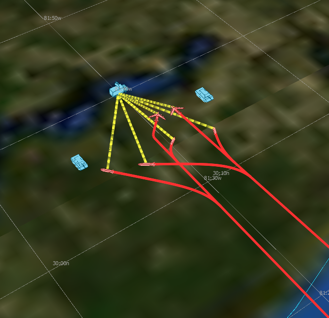

.. ****************************************************************************
.. CUI
..
.. The Advanced Framework for Simulation, Integration, and Modeling (AFSIM)
..
.. The use, dissemination or disclosure of data in this file is subject to
.. limitation or restriction. See accompanying README and LICENSE for details.
.. ****************************************************************************

.. demo:: training:script_processors

.. |classification| replace:: Unclassified
.. |date|           replace:: 2020-04-22
.. |group|          replace:: Training
.. |image|          replace:: images/script_processors.png
.. |tags|           replace:: n/a
.. |title|          replace:: Script Processors
.. |startup|        replace:: floridistan.txt
.. |summary|        replace:: This directory contains the solution for the Scripting Language and WSF_SCRIPT_PROCESSORs section of Basic User Training. Step 8.

.. include:: demo_template.txt

| The solution for the Script_Processors part of Basic User Training.
