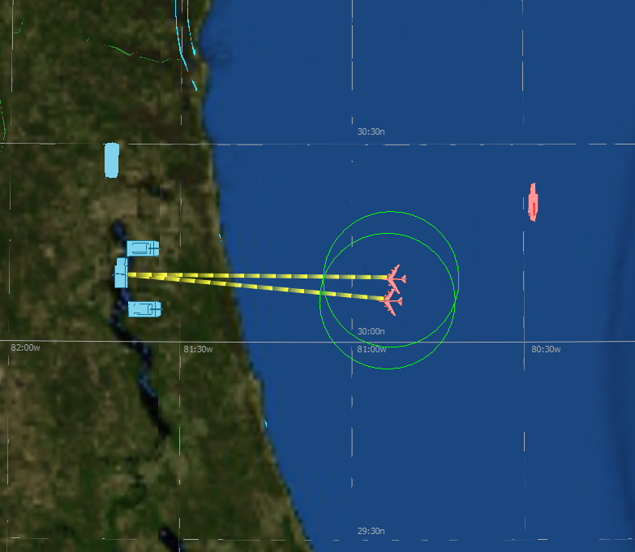

.. ****************************************************************************
.. CUI
..
.. The Advanced Framework for Simulation, Integration, and Modeling (AFSIM)
..
.. The use, dissemination or disclosure of data in this file is subject to
.. limitation or restriction. See accompanying README and LICENSE for details.
.. ****************************************************************************

.. demo:: training:wsfdraw_and_observers

.. |classification| replace:: Unclassified
.. |date|           replace:: 2020-04-22
.. |group|          replace:: Training
.. |image|          replace:: images/wsf_draw.png
.. |tags|           replace:: n/a
.. |title|          replace:: WsfDraw and Observers
.. |startup|        replace:: floridistan.txt
.. |summary|        replace:: This directory contains the solution for the WsfDraw and Script Observers section of Basic User Training. Step 9.

.. include:: demo_template.txt

| The solution for the WsfDraw and Observers part of Basic User Training.
