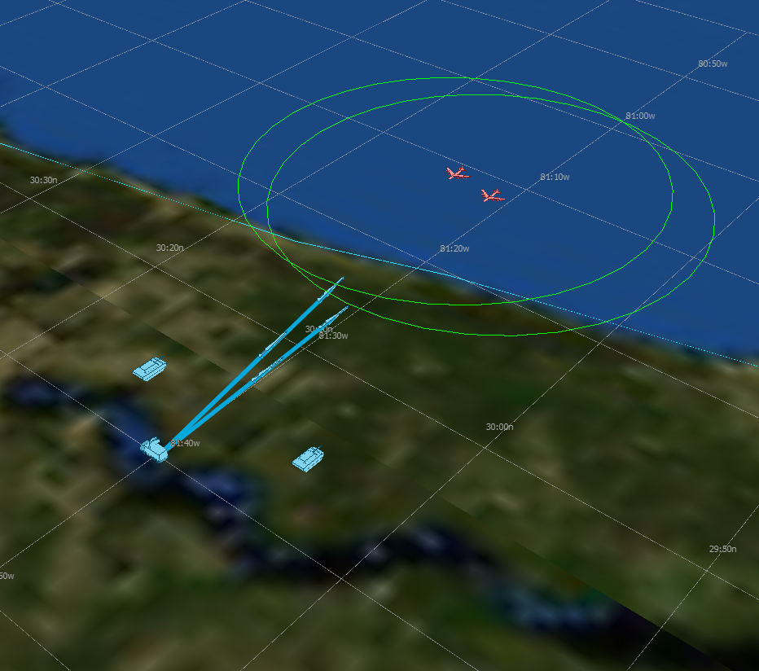

.. ****************************************************************************
.. CUI
..
.. The Advanced Framework for Simulation, Integration, and Modeling (AFSIM)
..
.. The use, dissemination or disclosure of data in this file is subject to
.. limitation or restriction. See accompanying README and LICENSE for details.
.. ****************************************************************************

.. demo:: training:state_machines

.. |classification| replace:: Unclassified
.. |date|           replace:: 2020-04-22
.. |group|          replace:: Training
.. |image|          replace:: images/state_machines.png
.. |tags|           replace:: n/a
.. |title|          replace:: State Machines
.. |startup|        replace:: floridistan.txt
.. |summary|        replace:: This directory contains the solution for the Task Processors and State Machines section of Basic User Training. Step 10.

.. include:: demo_template.txt

| The solution for the Task Processors and State Machines part of Basic User Training.
