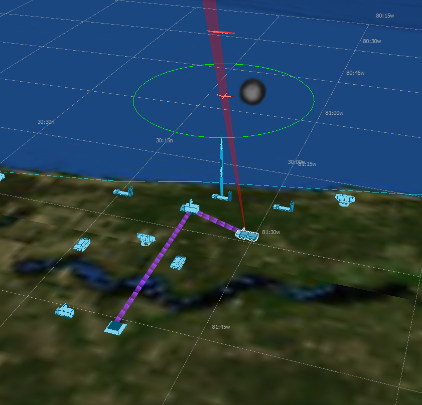

.. ****************************************************************************
.. CUI
..
.. The Advanced Framework for Simulation, Integration, and Modeling (AFSIM)
..
.. The use, dissemination or disclosure of data in this file is subject to
.. limitation or restriction. See accompanying README and LICENSE for details.
.. ****************************************************************************

.. demo:: training:command_chains_and_comms

.. |classification| replace:: Unclassified
.. |date|           replace:: 2020-04-22
.. |group|          replace:: Training
.. |image|          replace:: images/command_chain.png
.. |tags|           replace:: n/a
.. |title|          replace:: Command Chains and Comms
.. |startup|        replace:: floridistan.txt
.. |summary|        replace:: This directory contains the solution for the Command Chains and Comms section of Basic User Training. Step 11.

.. include:: demo_template.txt

| The solution for the Command Chains and Comms part of Basic User Training.
